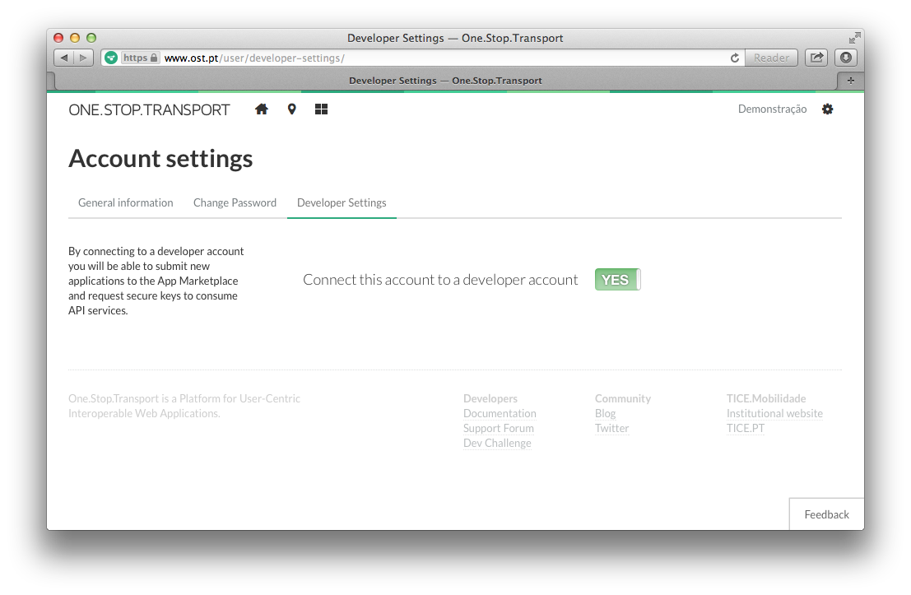
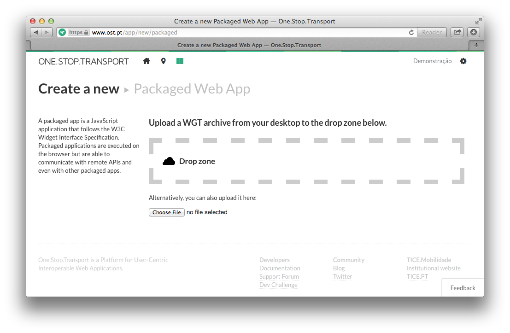

## Sobre

Com o objectivo de demonstrar algumas das funcionalidades que a plataforma [**One.Stop.Transport**](https://www.ost.pt) oferece, disponibiliza-se aqui um conjunto de exemplos de aplicações do tipo [*Packaged*](https://developer.ost.pt/docs/guia_do_programador/introducao_plataforma/), que invocam algumas *API* da plataforma.

## Objectivo

A partir destes exemplos, os *developers* conseguirão perceber rapidamente como desenvolver uma aplicação deste tipo, conhecendo também algumas das potencialidades que a plataforma OST oferece.

As aplicações disponibilizadas são:

* [**leaflet-app**](docs/leafletapp.md): aplicação web que permite desenhar círculos num mapa, usando a biblioteca [Leaflet](http://leafletjs.com/) e obter as paragens de autocarro e os percursos que intersectam os círculos.
* [**oauth2-demo**](docs/oauth2demo.md): utilizando o protocolo [OAuth 2.0](https://developer.ost.pt/docs/guia_do_programador/conceitos_chave/) para obter os dados do utilizador autenticado na plataforma.
* [**pois-viewer**](poisviewer.md): aplicação simples que se limita a mostrar 50 Pontos de Interesse em Coimbra, usando como API de mapas [Google Maps](https://developers.google.com/maps/).

Qualquer uma destas aplicações serve apenas como *esqueleto* para desenvolver aplicações novas.

**Atenção:** Não tentem submeter as aplicações, tal como estão, na plataforma pois elas não se encontram completas (ou funcionais). Primeiro, devem seguir as seguintes instruções.

---

## Instruções

Considerando que não se pretenda fazer nenhuma alteração a uma dada aplicação:

1. Descarregar o projecto / fazer `git clone git@github.com:OneStopTransport/Packaged-Apps.git`
2. Alterar o ficheiro `config.xml`, especialmente o **id** da tag `<widget>`:

	```xml
	<?xml version="1.0" encoding="utf-8"?>
	<widget xmlns="http://www.w3.org/ns/widgets" id="http://widgets.tice.ipn.pt/NEW-ID-GOES-HERE" fullscreen="true" version="1.0.0">
	   <name short="APP-NAME">What your app does</name>
	   <description>A quite longer description of what your app does</description>
	   <content src="index.html" />
	   <icon src="icon.png" />
	   <author>YOUR NAME</author>
	</widget>	
	```
3. Criar um arquivo `.zip` com todos os conteúdos presentes na pasta da aplicação (principalmente os ficheiro do tipo `.xml`, `.html`, `.js`, `.css`)
4. Mudar a extensão do arquivo zip acabado de criar para `.wgt`.
5. Feito, têm uma *packaged app* pronta a submeter em [**https://www.ost.pt**](https://www.ost.pt)

---

## Submissão na OST

Para submeterem a vossa aplicação na OST, devem primeiro criar uma conta no [portal OST](https://www.ost.pt) e activar a opção `Developer` nas [definições da conta](https://www.ost.pt/user/developer-settings/):



Para submeter a aplicação, podem fazê-lo acedendo à [página das aplicações](https://www.ost.pt/apps/web), escolhendo o marcador `Developed by you` / `Desenvolvido por si`, carregando no botão de adicionar e escolhendo a opção `Create a New Packaged App`, ou acedendo [directamente aqui](https://www.ost.pt/app/new/packaged).



Lá poderão submeter o arquivo `WGT` criado anteriormente.

---

## Ajuda / Como contribuir
-
-Podem usar o [**Fórum de Suporte**](https://support.ost.pt/everyone/) para deixarem as vossas dúvidas e sugestões ou podem contribuir para este projecto fazendo um *fork* no Github (saibam como fazê-lo [na documentação oficial](https://help.github.com/articles/fork-a-repo)).
