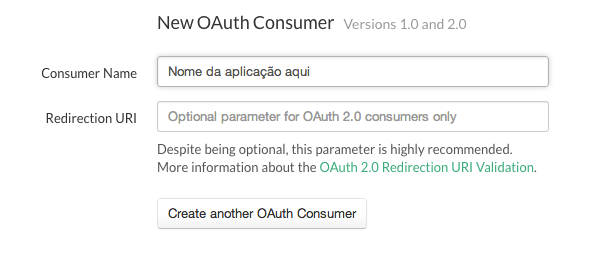

OAuth2 Demo
============

Aplicação que permite consultar alguns detalhes (nome, e-mail, data de registo, etc.) sobre a conta de utilizador autenticada na plataforma, através do protocolo [**OAuth2**](https://developer.ost.pt/docs/guia_do_programador/conceitos_chave/).

## Estrutura

A aplicação é constituída pelos seguintes ficheiros:

* `config.xml` - Ficheiro de configuração, necessário a cada *packaged app*, que identifica a aplicação, o autor e descreve o propósito da mesma;
* `index.html` - Página HTML com algum texto auto-gerado (*lorem ipsum*) e um botão para autorizar a plataforma a partilhar os dados da conta do utilizador;  
* `README.md` - Texto de introdução à aplicação.


## Requisitos

Para o correcto funcionamento da aplicação é necessário o seguintes elemento:

* **Consumer OAuth**: Ver [aqui](https://developer.ost.pt/docs/guia_do_programador/conceitos_chave/) como criar um *consumer* deste tipo.


## Instruções

1. Tal como referido nos Requisitos deste texto, comece por criar um *consumer OAuth*, [nesta página](https://www.ost.pt/dashboard/api-access), não colocando nada no campo `Redirection URI`:

    

2. Alterar o ficheiro `config.xml`, em particular o campo `id` do elemento `widget` e os elementos `name` e `description`:

	```xml
	<widget xmlns="http://www.w3.org/ns/widgets" id="http://widgets.tice.ipn.pt/YOUR_ID_HERE" fullscreen="true" version="1.0.0">
      <name short="YOUR APP NAME HERE">YOUR APP SMALL DESCRIPTION HERE</name>
      <description>YOUR APP DESCRIPTION HERE</description>
      <content src="index.html" />
      <icon src="icon.png" />
   	  <author>YOUR NAME HERE</author>
	</widget>
	```
	
2. Alterar o ficheiro `index.html` nomeadamente nas seguintes linhas:
	
	**Linha 87**: Trocar `YOUR_CONSUMER_KEY` pela `Consumer Key` do `OAuth Consumer` criado anteriormente:
	
	```javascript
	var qs = {
      response_type: 'token',
      client_id: 'YOUR_CONSUMER_KEY',
	```

3. Para poderem submeter a vossa aplicação alterada na plataforma OST, basta seguirem os passos presentes na secção **Instruções** e **Submissão na OST** do [README](../README.md) do projecto.


---

## Ajuda

Podem usar o [**Fórum de Suporte**](https://support.ost.pt/everyone/) para deixarem as vossas dúvidas e sugestões.


