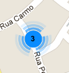

POIs Viewer
============

Aplicação simples que se limita a mostrar 50 Pontos de Interesse em Coimbra, usando como API de mapas [Google Maps](https://developers.google.com/maps/).

## Estrutura

A aplicação é constituída pelos seguintes ficheiros:

* `config.xml` - Ficheiro de configuração, necessário a cada *packaged app*, que identifica a aplicação, o autor e descreve o propósito da mesma;
* `index.html` - Página HTML com o mapa e a invocação à API de obtenção de Pontos de Interesse;
* `markerclusterer.js` - Biblioteca para *clustering* (agrupamento) de marcadores (de Pontos de Interesse) que se encontram muito próximos:

   

* `pois-viewer.jpg` - Logótipo da aplicação que aparecerá no *marketplace*, depois de submetida a aplicação;
* `README.md` - Texto de introdução à aplicação.


## Requisitos

Para o correcto funcionamento da aplicação são necessários os seguintes elementos:

* **Chave de API OST para Browser**: https://developer.ost.pt/docs/guia_do_programador/conceitos_chave/
* **Chave API Google Maps v3**: https://developers.google.com/maps/documentation/javascript/tutorial#api_key


## Instruções

1. Alterar o ficheiro `config.xml`, em particular o campo `id` do elemento `widget` e os elementos `name` e `description`:

	```xml
	<widget xmlns="http://www.w3.org/ns/widgets" id="http://widgets.tice.ipn.pt/YOUR_ID_HERE" fullscreen="true" version="1.0.0">
      <name short="YOUR APP NAME HERE">YOUR APP SMALL DESCRIPTION HERE</name>
      <description>YOUR APP DESCRIPTION HERE</description>
      <content src="index.html" />
      <icon src="pois-viewer.jpg" />
   	  <author>YOUR NAME HERE</author>
	</widget>
	```
	
2. Alterar o ficheiro `index.html` nomeadamente nas seguintes linhas:

	**Linha 10**: Trocar `YOUR_GMAPS_KEY` pela chave de API Google Maps v3 pedida nos Requisitos
	
	```html
	<script type="text/javascript" src="//maps.googleapis.com/maps/api/js?sensor=true&key=YOUR_GMAPS_KEY"></script>
	```
	
	**Linha 10, 11 e 40**: No caso de se querer testar localmente esta app (abrindo o ficheiro no *browser*), não deverá funcionar pois os protocolos de invocação das API e das bibliotecas não será o `file://` mas sim o `https://`, portanto tem de se substituir as duas barras por `https://`.
	
	**Linha 42**: Trocar `YOUR_OST_KEY` pela chave de API da OST pedida nos Requisitos
	
	```javascript
	data:     { 'key':'YOUR_OST_KEY', 'center':'-8.42917,40.21187', 'range':'100', 'results':'100' },
	```

3. Para poderem submeter a vossa aplicação alterada na plataforma OST, basta seguirem os passos presentes na secção **Instruções** e **Submissão na OST** do [README](../README.md) do projecto.


---

## Ajuda

Podem usar o [**Fórum de Suporte**](https://support.ost.pt/everyone/) para deixarem as vossas dúvidas e sugestões.


