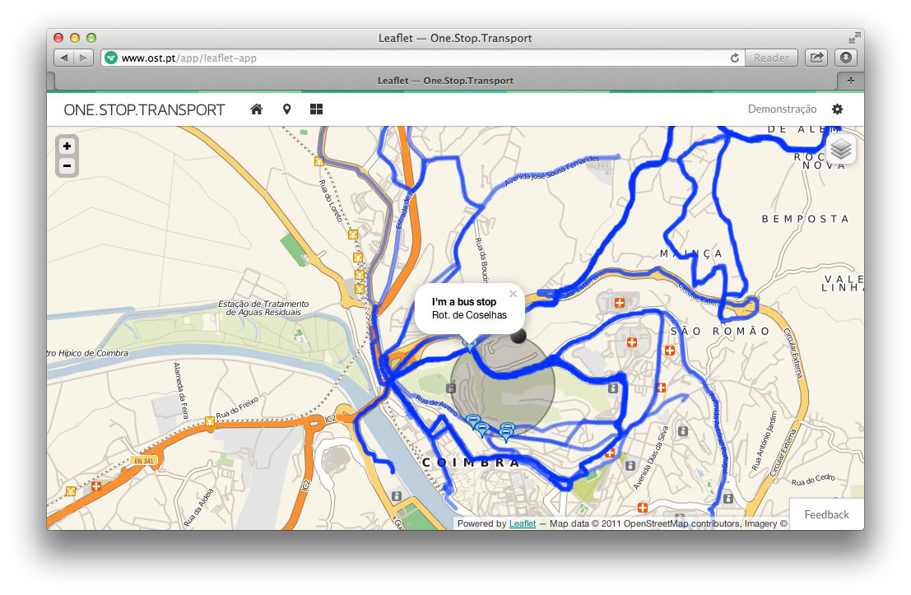

## Sobre

Esta aplicação é um exemplo que permite desenhar círculos num mapa, usando a biblioteca [Leaflet](http://leafletjs.com/) e obter as paragens de autocarro e os percursos que intersectam os círculos desenhados:

---

## Instruções

Por forma a conseguirem colocar esta aplicação a funcionar correctamente, é necessário obter uma **chave de API** (para *Browser*) na plataforma OST.

Por favor leiam a **documentação oficial** [1] sobre como obter chaves para as API da [**One.Stop.Transport**](https://www.ost.pt). Se quiserem instruções mais específicas sobre esta aplicação em concreto, consultem [**este documento**](../docs/leafletapp.md). Para conhecerem melhor as API disponíveis na plataforma, podem usar o explorador de API [2].

---

## Documentação

[1] **Chaves para API da OST**: https://developer.ost.pt/docs/guia_do_programador/conceitos_chave/

[2] **API Explorer** (explorador das API da OST): https://developer.ost.pt/api-explorer/
