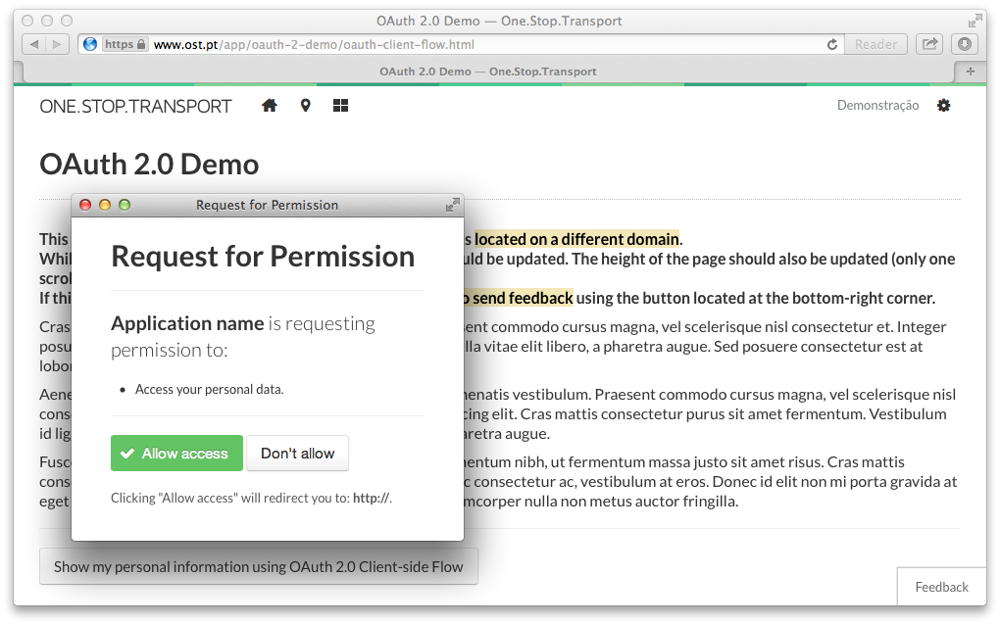

## Sobre

Esta aplicação serve para consultar alguns detalhes (nome, e-mail, data de registo, etc.) sobre a conta de utilizador autenticada na plataforma, através do protocolo [**OAuth2**](https://developer.ost.pt/docs/guia_do_programador/conceitos_chave/):

---

## Instruções

Por forma a conseguirem colocar esta aplicação a funcionar correctamente, é necessário obter um **consumer OAuth** na plataforma OST.

Por favor leiam a **documentação oficial** [1] sobre como criar `OAuth Consumers` para as API da [**One.Stop.Transport**](https://www.ost.pt) protegidas por este protocolo. Se quiserem instruções mais específicas sobre esta aplicação em concreto, consultem [**este documento**](../docs/oauth2demo.md). Para conhecerem melhor as API disponíveis na plataforma, podem usar o explorador de API [2]. 

---

## Documentação

[1] **Consumers OAuth da OST**: https://developer.ost.pt/docs/guia_do_programador/conceitos_chave/

[2] **API Explorer** (explorador das API da OST): https://developer.ost.pt/api-explorer/
