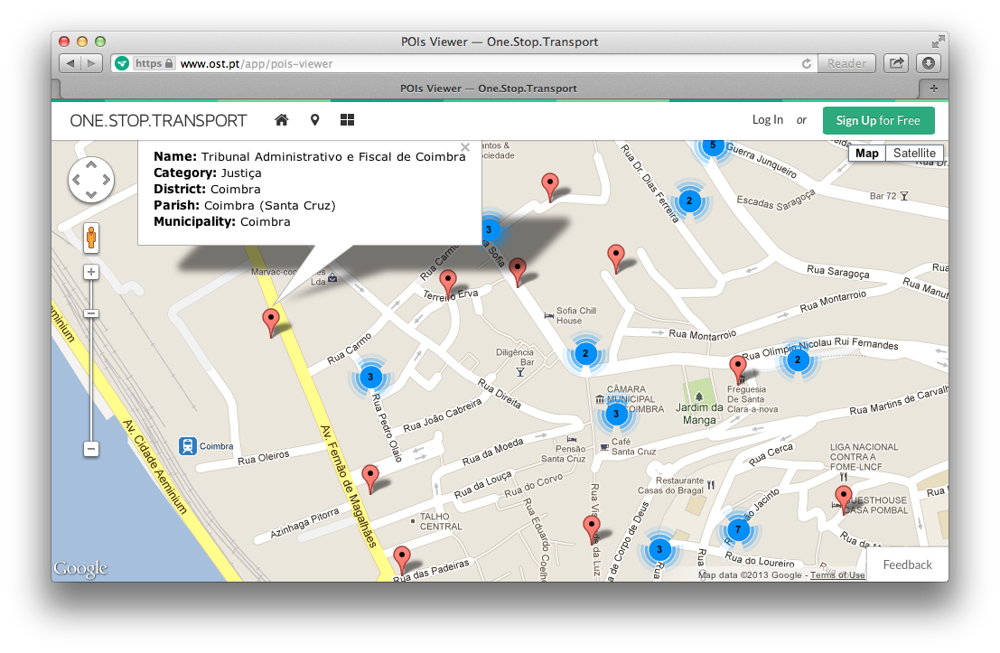

## Sobre

Esta aplicação serve muito simplesmente para invocar a API de Pontos de Interesse da plataforma e apresentá-los num mapa, usando a biblioteca [Google Maps](https://developers.google.com/maps/):

---

## Instruções

Por forma a conseguirem colocar esta aplicação a funcionar correctamente, é necessário obter uma **chave de API** (para *Browser*) na plataforma OST.

Por favor leiam a **documentação oficial** [1] sobre como obter chaves para as API da [**One.Stop.Transport**](https://www.ost.pt). Se quiserem instruções mais específicas sobre esta aplicação em concreto, consultem [**este documento**](../docs/poisviewer.md). Para conhecerem melhor as API disponíveis na plataforma, podem usar o explorador de API [2].

**Atenção:** Caso tentem abrir o ficheiro `index.html` no *browser* e não surja o mapa ou os marcadores com os pontos de interesse, por favor certifiquem-se que as bibliotecas `jQuery` e `Google Maps` estão a ser correctamente importadas (com *HTTPS*) e se as chamadas à API da OST também são feitas através deste protocolo. 

---

## Documentação

[1] **Chaves para API da OST**: https://developer.ost.pt/docs/guia_do_programador/conceitos_chave/

[2] **API Explorer** (explorador das API da OST): https://developer.ost.pt/api-explorer/
